Monte Carlo Path Tracer
=======
# Features Implemented
## Multiple Importance Sampling

direct light sampling, BSDF sampling and Multiple Importance Sampling
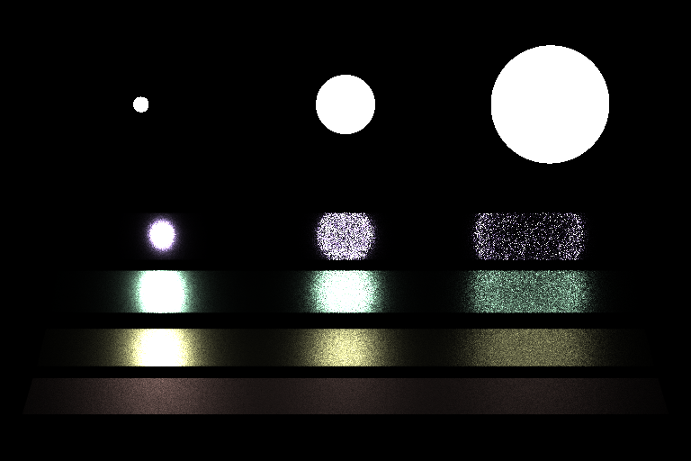
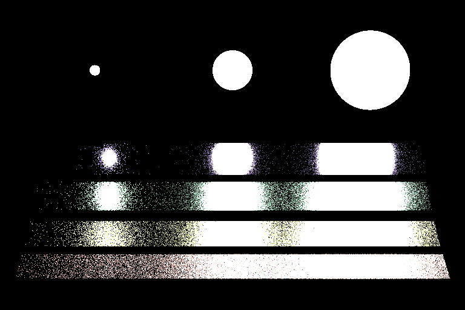
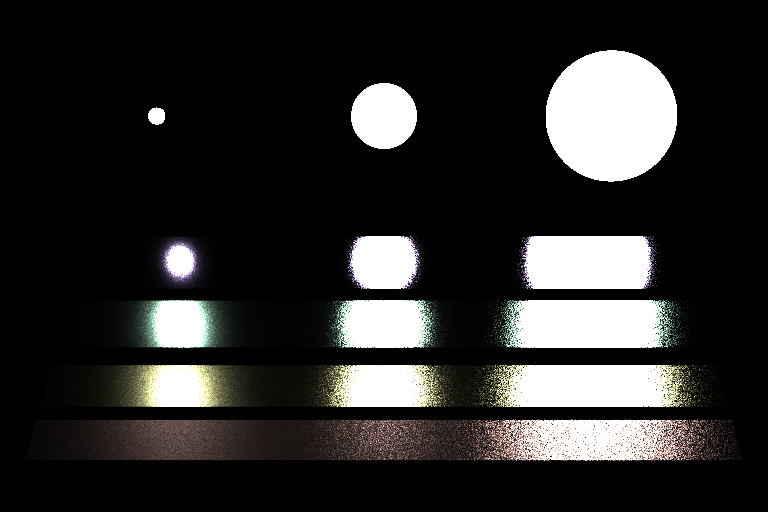

### Different BSDFs

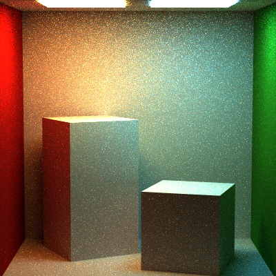
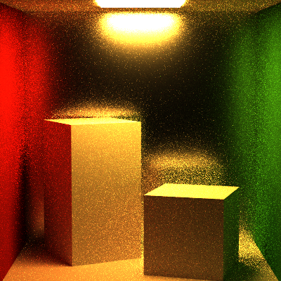
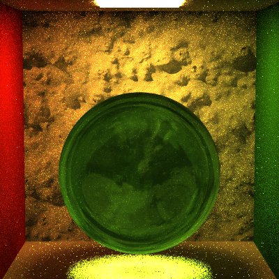

### Volumetric

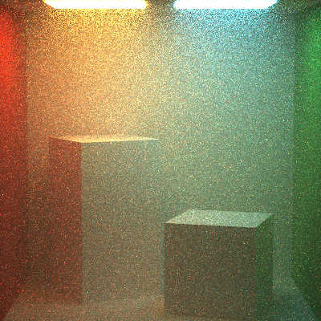
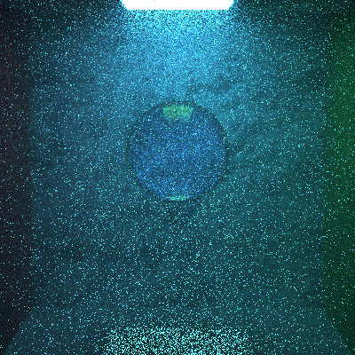

### Photon Mapping(with some artifacts)

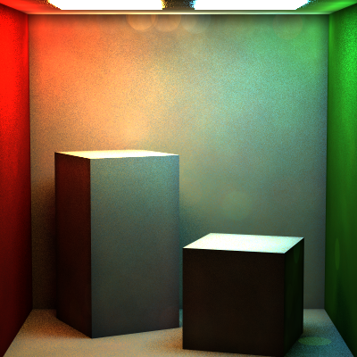

### Other

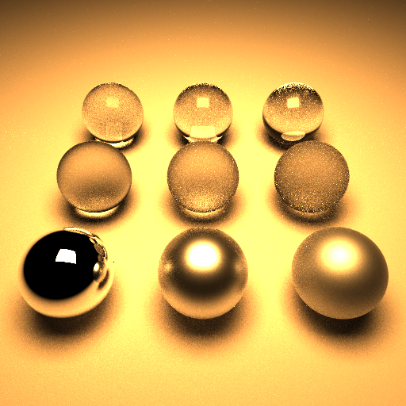
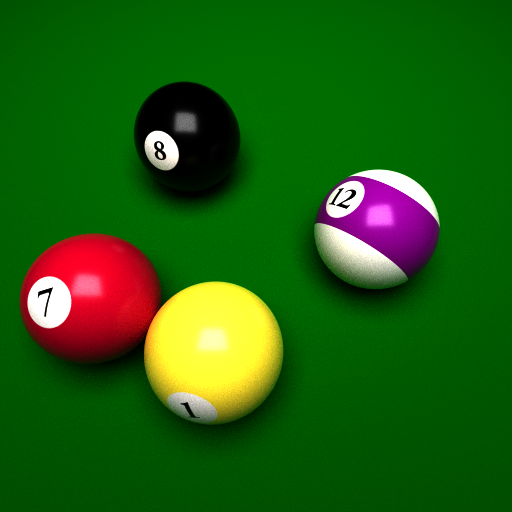
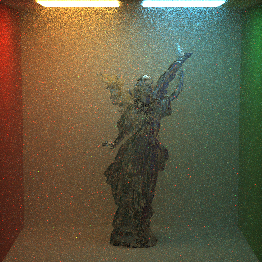
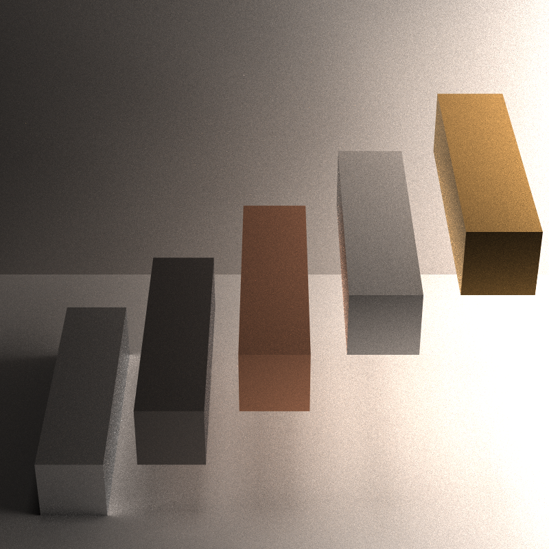