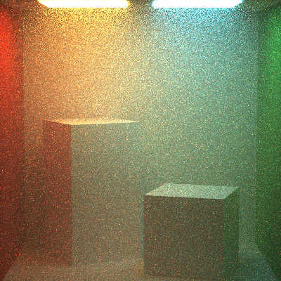
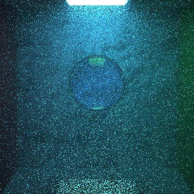
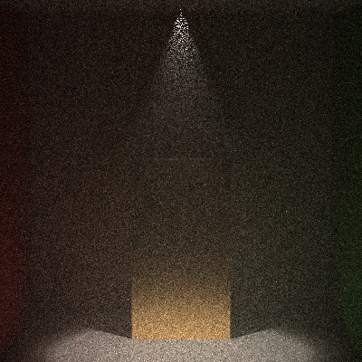
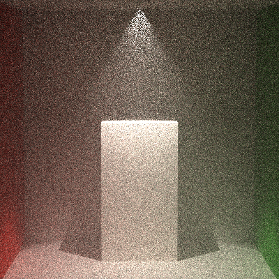

Final Project
======================

**University of Pennsylvania, CIS 561: Advanced Computer Graphics, Final Project**

Name: Ziyin Qu Pennkey: ziyinq
------------

Volumetric results
------------
* **left**: 20*20 samples, 8 recursions, homogeneous medium
* **right**: 10*10 samples, 5 recursions, glass material, homogeneous medium

Both of the results are using sigma_a = Color3f(0.0), sigma_t = Color3f(0.05), g = 0.7

Spotlight results
------------
* **left**: 10*10 samples, 5 recursions, gold material, homogeneous medium
* **right**: 10*10 samples, 5 recursions, lambert material, homogeneous medium

   

Overview
------------
As the semester draws to its close, we embark on the final additions to your
path tracers. You have two options for your final project: implement several
smaller-scale additions to your path tracer, or implement one larger addition.
We will not provide any base code for this assignment; it is up to you to
create any classes you will need to complete your feature(s).

Useful Reading
---------
The following PBRT chapters are relevant to the features listed for this
assignment:
* Chapter 6.4: Realistic Cameras
* Chapter 12: Light Sources
* Chapter 15: Volume Rendering
* Chapter 16: Bidirectional Methods

Submitting final renders (15 points)
-------------
The deadline for code completion and submission is Tuesday, April 24 at midnight.
However, you may take up until Wednesday, April 25 at 12:00 noon to submit
final renders from your path tracer. On Wednesday, April 25 we will run
through a slide show of everyone's renders, allocating at most 2 minutes per
student.

Please provide any captions you deem important to your renders, including
listing the features each render is showcasing. __We expect at least one of your
rendered images to be demo-reel worthy, meaning a minimum of 1024x1024 pixels
and a high level of convergence (at least 20x20 samples per pixel) along with
measured render times.__ If you wish, you may discuss your renders and features
during your 2 minutes.

Submit your renders both in your Github repository and in [this Google
Slides set](https://docs.google.com/presentation/d/1NzG9TVk7yWxe90ShlFyNXGB2bJuZZb6_jizqvOiWf7o/edit?usp=sharing), so we can present them im class.

Option I: A collection of smaller-scale additions (85 points)
-------------------
Implement __each__ of the following features to expand your existing path
tracer:
* #### Lens-based camera
Implement the thin-lens camera model as described in chapter 6.2.3 of PBRT.
You may wish to make this class inherit from the base `Camera` class we have
provided. You will also have to alter the `Scene` class to include an instance
of this new camera type. Render at least one scene with this new camera in
order to exhibit its depth-of-field effect.
* #### Constructive Solid Geometry
Create a data structure, e.g. a binary
tree, that can be used to combine different geometries using the three basic
CSG operations: union, difference, and intersection. You will have to write an
`Intersect` function for this data structure, and would be best served to make
it inherit from the `Primitive` class. Your data structure does not need to
handle materials or light sources; these may be properties of the `Primitives`
contained _within_ the data structure.
* #### Complex implicit surfaces
Implement a type of `Shape` that uses ray marching to find an intersection with
itself, testing the ray march against a mathematical equation representing a
surface rather than, say, a voxel data structure. The [lecture slides](https://cis700-procedural-graphics.github.io/files/implicit_surfaces_2_21_17.pdf) from Penn's
procedural graphics course will be particularly helpful in this task. Please
implement at least three different (and interesting!) surface formulas for your
implicit surface class. [Wolfram Mathworld](http://mathworld.wolfram.com/topics/Surfaces.html) has a nice collection of 3D surface
formulas.
* #### Other light Sources
Implement at least two of the light sources described in Chapter 12 of PBRT,
aside from `DiffuseAreaLight`, which has already been provided to you. If
you choose to implement additional light types, each one will be worth 10 extra
credit points.

Option II: A larger-scale addition (95 points)
------------------
Implement __one__ of the features listed below to expand your path tracer. Note that this option is also worth ten bonus points.
* #### Path Tracing with Participating Media (Volumetric Rendering)
Implement an integrator in your path tracer capable of handling participating
media. We require that it handle _at least_ homogeneous media, but we encourage
you to implement heterogeneous media as well. For interesting renders, try
incorporating transmissive spheres to focus light beams through the medium.
* #### Bidirectional Path Tracer
Implement an integrator that performs bidirectional path tracing. This type of
path tracing is especially effective in scenes where the light sources are
highly occluded, such as a scene where a light is enclosed by a transmissive
object. In these scenarios, the direct lighting computation at each path vertex
will almost never produce light energy, making the scene illuminated almost
entirely by global illumination. By tracing rays from both the light sources
and the camera, we ensure that our ray paths eventually reach the light source,
even without a direct lighting pass. For your bidirectional engine, we only
require naive integration; incorporating multiple importance sampling into such
a renderer is actually more complicated than one might expect.

Extra credit (30 points maximum)
-----------
As always, you are free to implement other features for extra credit that are
not listed below. Make a private post on Piazza so we can help you determine
how many points your feature(s) would be worth.

Submitting your project
--------------
Along with your project code, make sure that you fill out this `README.md` file
with your name and PennKey, along with your test renders.

Rather than uploading a zip file to Canvas, you will simply submit a link to
the committed version of your code you wish us to grade. If you click on the
__Commits__ tab of your repository on Github, you will be brought to a list of
commits you've made. Simply click on the one you wish for us to grade, then copy
and paste the URL of the page into the Canvas submission form.
